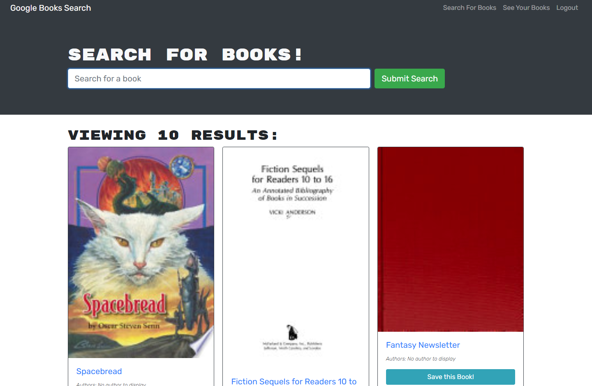

# Book Search Engine

## Desription

The code for a REST API was provided in order to refactor the API into using GraphQL and an Apollo Server.

The deployed application can be viewed [here](https://kenny-book-search-engine.herokuapp.com).

## Contents

* [Usage](#usage)
* [Built With](#built-with)
* [Questions](#questions)

## Usage

Users can search for books using the Google Books API, and when signed in they can save book titles they are interested in to their account.

## Built With

* Node.js
* Express.js
* JavaScript
* Apollo Server Express
* GraphQL

## Questions

Created by: [Kenny Larson](https://github.com/kenneththelarson)

For further question please contact [kenneththelarson@gmail.com](mailto:kenneththelarson@gmail.com)